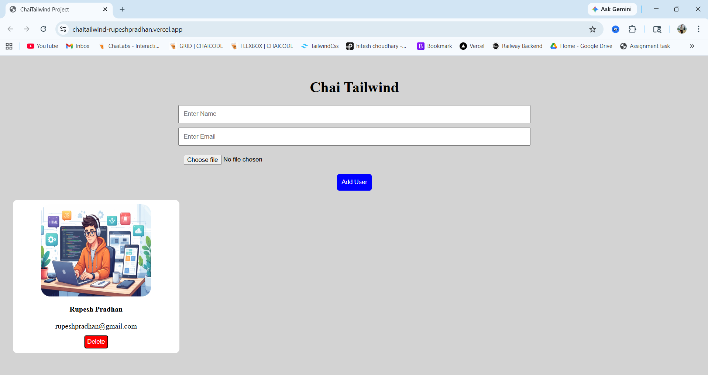

# 🚀 ChaiTailwind

🔗 Live Demo: https://chaitailwind-rupeshpradhan.vercel.app/  
💻 GitHub Repo: https://github.com/merupeshpradhan/ChaiTailwind  

---

## 📖 About Project

ChaiTailwind is a lightweight utility-first CSS engine built using JavaScript.  
It works similar to Tailwind CSS, where instead of writing traditional CSS, you use custom class names.

---

## 💡 Example Classes

- chai-p-2 → padding: 2px  
- chai-bg-red → background-color: red  
- chai-text-center → text-align: center  

---

## ⚙️ How It Works

- Scans the DOM after page load  
- Finds all classes starting with `chai-`  
- Parses class names dynamically  
- Converts them into inline styles  
- Applies styles directly to elements  

---

## ✨ Features

- Spacing (padding & margin)  
- Colors (background & text)  
- Typography (font size & alignment)  
- Borders & border-radius  
- Basic layout utilities  

---

## 🎥 Demo Video

https://drive.google.com/file/d/1RuWRjvW7pVlbxbua1WGtdc_RogahiWGJ/view?usp=drive_link

---

## 📸 Screenshots

---

## 📁 Project Structure
